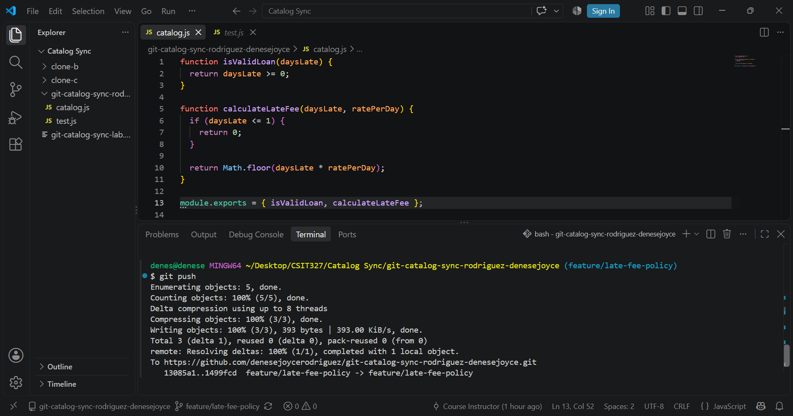
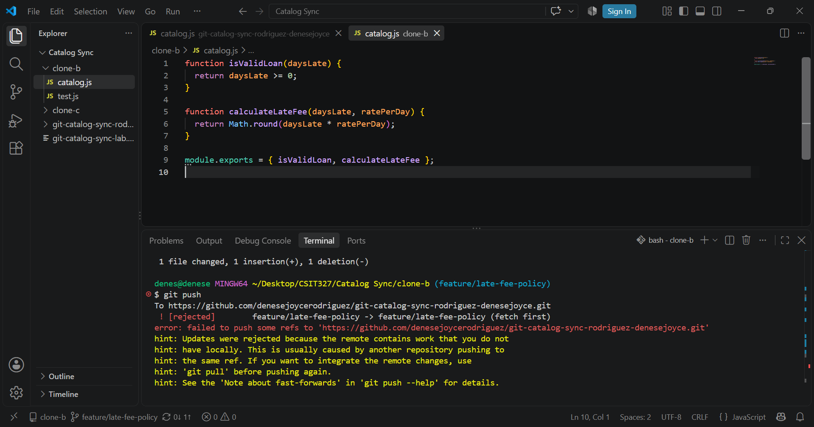
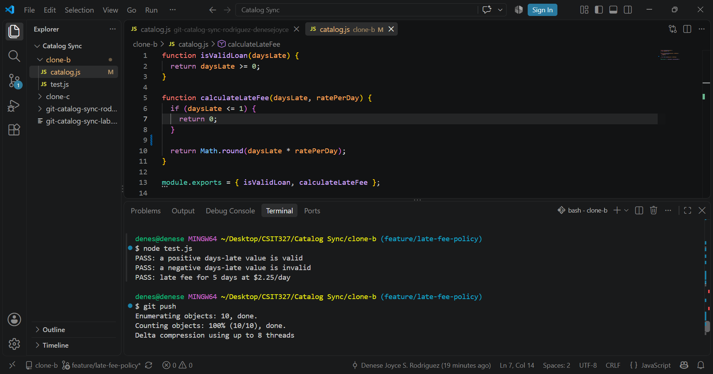
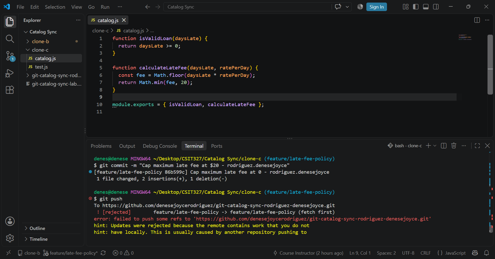
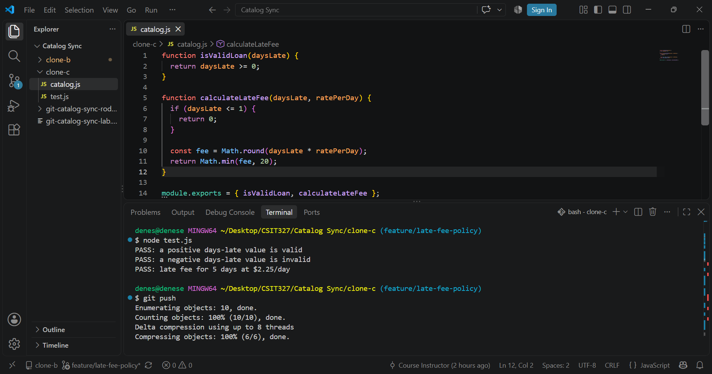
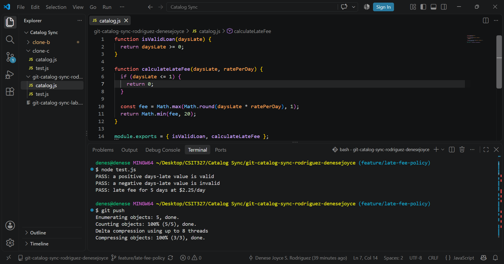
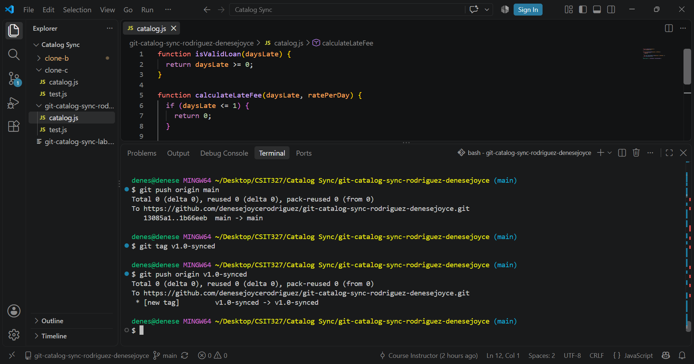

# Git Catalog Sync Workflow

**Name:** Denese Joyce Rodriguez
**Subject & Section:** CSIT327 - G7
**Repository:** git-catalog-sync-rodriguez-denesejoyce

---

# Task 1

Added a 1-day grace period in Clone A and pushed it.

---

# Task 2

Changed the fee calculation to use `Math.round()` in Clone B. The push was rejected because the remote branch had newer commits.

---

# Task 3

Fetched and merged the remote branch, resolved the conflict, kept both the grace period and rounding, ran the tests, and pushed successfully.

---

# Task 4

Added a $20 maximum fee cap in Clone C. The push was rejected because Clone C was behind the updated feature branch.

---

# Task 5

Resolved the three-way merge conflict so the grace period, rounding, and $20 cap all worked together. The tests passed and I pushed the merged branch.

---

# Task 6

Added a $1 minimum fee in Clone A, reconciled the branch with `git fetch` and `git rebase`, resolved the conflict, tested the code, and pushed without using force.

---

# Task 7

Merged the feature branch into `main`, pushed it, created the `v1.0-synced` tag, and pushed the tag to GitHub.

---

# Reflection Questions

## 1. Walk through the final `calculateLateFee` function.

- **Grace period:** Clone A added the `daysLate <= 1` check, so no fee is charged for one day or less.
- **Rounding:** Clone B replaced `Math.floor()` with `Math.round()` so the fee is rounded instead of truncated.
- **Minimum fee:** Clone A later added `Math.max(..., 1)` to ensure the fee is at least $1 after the grace period.
- **Maximum fee:** Clone C added `Math.min(..., 20)` to cap the fee at $20.

## 2. Compare Task 3 and Task 5.

Task 3 was a two-way conflict because only two contributors edited the same function. Task 5 was more difficult because three different changes had to be combined manually, making it easier to accidentally remove someone else's work.

## 3. Difference between merge and rebase.

A **merge** combines two histories by creating a merge commit while preserving both branches. A **rebase** moves my local commit on top of the updated remote history, creating a cleaner, linear commit history without a merge commit.

## 4. One process change that would prevent the rejected pushes.

The team should always **fetch or pull the latest changes before starting work** on the feature branch. Keeping everyone synchronized would greatly reduce rejected pushes and merge conflicts.